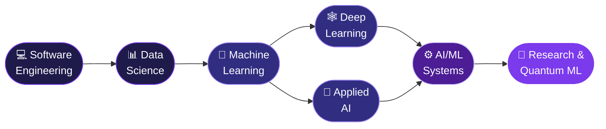

<!-- ═══════════════ HEADER ═══════════════ -->
<div align="center">


<a href="https://github.com/devchandhana12">
  
</a>

<br/>

[](https://dev-chethan.com)
[](https://www.linkedin.com/in/chethan-nandigala-936897232/)
[](mailto:chethan120397@gmail.com)


</div>

<br/>

<!-- ═══════════════ ABOUT ═══════════════ -->
## ✨ About Me

I'm a **Senior Software Engineer in Bangalore 🇮🇳** with **6+ years** of shipping web, mobile and backend products, now channeling that engineering depth into **Data Science, Machine Learning and Applied AI**.

My belief: *great AI is 20% model, 80% engineering.* I like building the whole thing, from the data pipeline to the pixel on the screen.

```python
class Chethan:
    role        = "Senior Software Engineer"
    based_in    = "Bangalore, India 🇮🇳"
    experience  = "6+ years"

    builds      = ["Web apps", "Mobile apps", "Backend services", "AI-powered products"]
    exploring   = ["Deep Learning", "LLMs", "RAG", "AI Agents"]
    languages   = ["Python", "TypeScript", "JavaScript"]

    def current_mission(self):
        return "Build intelligent systems backed by strong engineering and data."

    def long_term_goal(self):
        return "ML Research → Quantum Machine Learning"
```

<br/>

<!-- ═══════════════ FOCUS CARDS ═══════════════ -->
## 🎯 What I'm Focused On

<table align="center">
  <tr>
    <td align="center" width="25%">
      <h3>📊</h3>
      <b>Data Science</b><br/>
      <sub>Preprocessing, EDA &<br/>feature engineering</sub>
    </td>
    <td align="center" width="25%">
      <h3>🧠</h3>
      <b>Machine & Deep Learning</b><br/>
      <sub>Model development<br/>with PyTorch & scikit-learn</sub>
    </td>
    <td align="center" width="25%">
      <h3>📚</h3>
      <b>LLMs & RAG</b><br/>
      <sub>Retrieval pipelines &<br/>vector search</sub>
    </td>
    <td align="center" width="25%">
      <h3>🤖</h3>
      <b>AI Agents</b><br/>
      <sub>Tool-using, multi-step<br/>agentic workflows</sub>
    </td>
  </tr>
</table>

<br/>

<!-- ═══════════════ CURRENTLY BUILDING ═══════════════ -->
## 🔭 Currently Building

<div align="center">

### 🧩 Mini Transformer, from scratch
*Understanding attention by implementing it, not just importing it.*

`Python` `PyTorch` `Attention` `Transformers`

</div>

**Roadmap** &nbsp;·&nbsp; 🚧 *in progress*

- [ ] Tokenizer and embeddings
- [ ] Scaled dot-product & multi-head self-attention
- [ ] Transformer block (layer norm, residuals, feed-forward)
- [ ] Training loop on a small text dataset
- [ ] Text generation + write-up of what I learned

> 📝 I'll tick these off and link the repo here as I go.

<br/>

<!-- ═══════════════ TECH STACK ═══════════════ -->
## 🛠️ Tech Stack

<div align="center">

| | |
|:--|:--|
| **🐍 Languages** |  |
| **🎨 Frontend** |  |
| **⚙️ Backend & Data** |  |
| **🧪 AI / ML** |  |
| **🧠 LLM Tooling** | Hugging Face · LangChain · LangGraph · Qdrant · Pinecone · ChromaDB |
| **🧰 Tools** |  |

</div>

<br/>

<!-- ═══════════════ JOURNEY ═══════════════ -->
## 🧭 The Journey



<br/>

<!-- ═══════════════ CONNECT ═══════════════ -->
## 🤝 Let's Connect

I'm always up for conversations about **AI products, RAG systems, agents, and ML engineering**, or just good engineering in general.

<div align="center">

[](https://dev-chethan.com)
[](mailto:chethan120397@gmail.com)
[](https://www.linkedin.com/in/chethan-nandigala-936897232/)

<br/>

> ### *From pixels to pipelines, from APIs to AI.*


</div>
